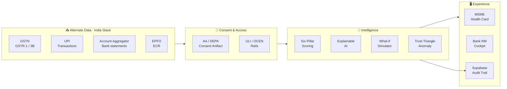

<div align="center">

<!-- Animated Header -->


<!-- Live Badges -->
<p>
  <a href="https://team-synora-idbi-hackathon.vercel.app/"></a>
  
  
  
</p>

<p>
  
  
  
  
  
  
  
  
  
</p>

<br/>

> **An India-Stack-native MSME Financial Health Card — turning the data a business already generates into an explainable credit decision, in minutes.**

### ▸ [**Launch the live product →**](https://team-synora-idbi-hackathon.vercel.app/)

</div>

---

## The Idea Behind UdyamPulse

> *India has **63 million+ MSMEs**, yet an estimated **₹20–25 lakh crore** of their credit demand goes unmet. The businesses that need capital most are the ones banks can see least.*

Traditional MSME credit evaluation fails viable borrowers in three ways:

- **Thin files** — New-to-Credit and New-to-Bank enterprises lack the audited balance sheets and bureau history that scorecards demand
- **Fragmented signals** — Rich alternate data (GST, UPI, Account Aggregator, EPFO) exists, but there is no unified framework to read it together
- **Black-box rejections** — A "no" comes with no reasons and no path forward, so a good business stays credit-invisible forever

**UdyamPulse** is a working full-stack prototype that solves all three — built by **Team Synora** for **IDBI Innovate 2026**, as a live product, not a slide deck.

---

## What It Does

UdyamPulse connects **the data a business already generates** (GST filings, UPI flows, bank statements, EPFO records) to **a credit decision the bank can trust** and **a path the borrower can act on** — all under consent.

```
🔐 Consent   ──►   📥 Aggregate   ──►   📊 Score   ──►   🔍 Explain   ──►   💰 Offer
  (AA/DEPA)         (GST·UPI·AA·EPFO)     (6 pillars)      (glass box)       (OCEN · ₹)
                                              │
                                              ▼
                                   🏦 Bank RM Cockpit
                                   (early-warning · decisions)
```

Two stakeholders, one score, zero black boxes.

---

## How It Works

### 1. Consent-First Onboarding
A business enters its Udyam / PAN and grants a granular, time-bound consent through the **Account Aggregator (DEPA)** framework. Six data sources light up as they connect — nothing is pulled without consent, and the data is purged after the decision.

### 2. Six-Pillar Pulse Score
Consented signals are normalized into features and scored across six weighted pillars into a single **Pulse Score (0–100)** and a grade (A+ → D). The model is **deterministic and transparent** — the same inputs always yield the same score and the same reasons.

### 3. Explainable AI Breakdown
Every pillar decomposes into plain-language reasons tied to a real data event — *"+12 for 12/12 on-time GST filings, −4 for one NACH bounce."* Auditable for a regulator, understandable for the borrower. No black box.

### 4. Path to a Better Grade (What-If)
Instead of a flat rejection, a thin-file business sees exactly what to change — file the next GST returns on time, clear a bounce, raise digital revenue — and watches the score, grade, and rupee eligibility recompute live. Rejection becomes a nurture funnel.

### 5. The Trust Triangle
Three independent views of the same business — **GST-declared turnover, bank credits, and UPI inflow** — must reconcile. Inflated or round-tripped revenue breaks the triangle and is flagged before a rupee is disbursed. Fraud detection without a black box.

### 6. Bank RM Cockpit
Relationship managers get a portfolio view with score distribution, exposure at risk, and **score-drift early-warnings that flag stress 60–90 days before a conventional default signal** — plus a one-click OCEN offer with CGTMSE cover, ready to push to the loan system.

---

## Architecture



- **Frontend** — React 19 + TypeScript on Vite; Tailwind CSS v4 (light/dark); Framer Motion animation; Recharts data-viz
- **Intelligence** — transparent six-pillar scoring engine, What-If re-scoring, cross-source Trust-Triangle anomaly detection (production path: gradient-boosted model with SHAP attribution)
- **Data** — Supabase (Postgres) for the assessment & decision audit trail, with a resilient local fallback so the demo never breaks offline
- **Rails** — designed around India-Stack (Account Aggregator, GSTN, UPI, EPFO, ULI, OCEN); the bank stays the regulated lender

---

## Tech Stack

<table>
<tr>
<td valign="top" width="50%">

### Frontend
| Layer | Technology |
|-------|-----------|
| Framework | React 19 |
| Build | Vite |
| Language | TypeScript 5 |
| Styling | Tailwind CSS 4 |
| Animation | Framer Motion |
| Data Viz | Recharts |
| Icons | lucide-react |
| Theming | Light / Dark tokens |

</td>
<td valign="top" width="50%">

### Intelligence & Data
| Layer | Technology |
|-------|-----------|
| Scoring | Six-pillar deterministic engine |
| Explainability | Per-feature contribution (SHAP-ready) |
| Simulation | What-If re-scoring engine |
| Fraud | Trust-Triangle reconciliation |
| Datastore | Supabase / PostgreSQL |
| Deploy | Vercel |
| Rails | AA · GSTN · UPI · EPFO · ULI · OCEN |
| Compliance | DPDP Act 2023 by design |

</td>
</tr>
</table>

---

## Feature Highlights

| Feature | What It Does |
|---------|-------------|
| **Financial Health Card** | Animated Pulse gauge, 6-axis radar, grade, and a cash-flow-based rupee credit offer |
| **Six-Pillar Score** | Cash-flow, momentum, repayment, compliance, workforce & digital footprint, fused into one 0–100 score |
| **Explainable AI** | Every point traced to a source event, in plain language — auditable and reproducible |
| **Path to a Better Grade** | What-If simulator that turns a rejection into a concrete improvement plan with unlocked credit |
| **Trust Triangle** | GST vs bank vs UPI reconciliation catches inflated / round-tripped revenue without a black box |
| **Vernacular Assistant** | Explains the Health Card in Hindi, Gujarati, Tamil & English |
| **RM Portfolio Cockpit** | Score distribution, exposure at risk, and score-drift early-warnings 60–90 days ahead of default |
| **OCEN Offer + CGTMSE** | Ready-to-emit offer with credit-guarantee structuring for thin-file borrowers |
| **Consent-First (DEPA)** | Granular, revocable Account Aggregator consent; data purged after the decision |
| **Light / Dark Theme** | Fully themed experience with a one-tap toggle |

---

## Business Profiles

> Assess five reproducible MSME profiles end-to-end from the business switcher — no improvisation needed.

```
🧵 Meena Textiles     — Surat · NTC/NTB, woman-led · rejected by 3 banks → Pulse 88 / A+ / ₹5.6L
🍲 Kaveri Foods       — Coimbatore · established, clean books → Grade A
🏪 Sharma Provisions  — Nagpur · steady neighbourhood Kirana → Grade B+
📱 Anand Mobile Care  — Kanpur · thin-file, credit-invisible → Grade C, with a live "path to B"
📦 Zenith Traders     — Delhi · looks strong on paper, but the Trust Triangle flags it
```

Each profile drives the full journey: consent → aggregate → score → explain → simulate → offer, plus the bank-side early-warning view.

---

## Repository Layout

```
Team-Synora-IDBI-Hackathon/
├── src/
│   ├── lib/
│   │   ├── scoringEngine.ts     # Six-pillar deterministic model + grade + limit
│   │   ├── whatIfEngine.ts      # Live delta re-scoring ("path to a better grade")
│   │   ├── anomalyEngine.ts     # Trust-Triangle cross-source reconciliation
│   │   ├── repository.ts        # Supabase audit trail (non-blocking, local fallback)
│   │   ├── supabase.ts          # Client (enabled only when configured)
│   │   ├── format.ts            # Indian currency / number helpers
│   │   └── types.ts             # Domain model
│   ├── data/
│   │   ├── personas.ts          # 5 reproducible MSME profiles + cash-flow series
│   │   ├── portfolio.ts         # Bank book with score-drift trends
│   │   ├── consent.ts           # AA / DEPA consent template & sources
│   │   └── assistantScript.ts   # Multilingual assistant intents
│   ├── components/              # Gauge, radar, waterfall, Trust-Triangle, charts, shell
│   ├── screens/                 # MSME journey + Bank RM cockpit
│   ├── state/app.tsx            # Role, business & theme context
│   └── index.css               # Design tokens (light/dark) + Tailwind v4 theme
│
├── supabase/schema.sql         # Audit tables, registry & RLS policies
├── vercel.json                 # Deploy config
├── .env.example                # Supabase environment template
└── README.md                   # You are here
```

---

## Quick Start

### Prerequisites
- **Node.js** 20+

### Run locally
```bash
npm install
npm run dev        # http://localhost:5173
```

```bash
npm run build      # production build
npm run preview    # preview the build
```

Open the app → start with **Meena Textiles** → walk the MSME journey, then switch to the **Bank** role for the portfolio cockpit.

### Optional — connect Supabase
```bash
cp .env.example .env.local
# add VITE_SUPABASE_URL and VITE_SUPABASE_ANON_KEY
```
Then run [`supabase/schema.sql`](supabase/schema.sql) in the Supabase SQL editor. Without these variables the app runs fully on its bundled datastore.

---

## Scoring Model

The Pulse Score is a transparent weighted blend of six pillars, each fed by an alternate-data source:

| Pillar | Source | Weight |
|--------|--------|:------:|
| Cash-Flow Vitality | Account Aggregator + UPI | **25%** |
| Business Momentum | GSTN (GSTR-1 / 3B) | **20%** |
| Repayment Discipline | AA debits · NACH | **20%** |
| Compliance & Formalization | GST · ITR · Udyam · TDS | **15%** |
| Workforce Stability | EPFO · ECR | **10%** |
| Digital & Ecosystem Footprint | UPI · AA counterparties | **10%** |

`PulseScore = 0.25·D1 + 0.20·D2 + 0.20·D3 + 0.15·D4 + 0.10·D5 + 0.10·D6`

The score maps to grade bands (A+ → D) and a cash-flow-based working-capital offer, dampened by grade. It is intentionally a **glass box**: every point is attributable to a source event, so a borrower can improve it and a regulator can audit it.

---

## Ethics & Scope

UdyamPulse is a **competition and research prototype** built for IDBI Innovate 2026. It is **not** a certified credit bureau, not a replacement for a bank's regulated underwriting, and not intended for production lending without proper model validation, data-governance review, and regulatory approval.

All data access is designed to be **consent-first** (Account Aggregator / DEPA) and **DPDP Act 2023** compliant. The bank remains the regulated decision-owner; UdyamPulse provides explainable decision *support*.

---

<div align="center">

Built with rigor and empathy by **Team Synora** · IDBI Innovate 2026

---

*"CIBIL scores your past. UdyamPulse scores your present."*


</div>
